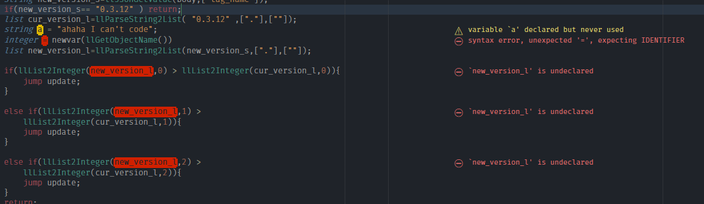

# SublimeLinter-contrib-lslint

This [SublimeLinter 3](https://github.com/sublimelinter/sublimelinter3) plugin provides an interface to lslint.
This plugin applies linting to files that have the `lsl` and `ossl` syntax.
If you do not know what a linter is or are new to SublimeLinter, please refer to the [SublimeLinter documentation](http://www.sublimelinter.com/en/latest).

## Special warning

~~Due to SublimeLinter4 beaking this plugin, you **need** to disable automatic package upgrade until a better solution is found/created. Sorry about that.~~

**This package only works with SublimeLinter v3.**
You need to add the following repository to package control (`Command Palette -> Package control -> Add Repository`): `https://github.com/SublimeLinter/SublimeLinter/tree/v3`, then install SublimeLinter from Package Control.

## Quick start

You're advised to install [Will Bond](https://wbond.net)'s [Package Control](https://packagecontrol.io) (see the [installation](https://packagecontrol.io/installation) page there) for [Sublime Text](https://www.sublimetext.com), which makes finding, installing and **keeping packages up-to-date** much easier.

### Requirements

* [Sublime Text](https://www.sublimetext.com)
* [SublimeLinter 3](https://github.com/sublimelinter/sublimelinter3) (You must install SublimeLinter 3 manually. SublimeLinter4 does not work with this plugin.)

## Installation

In Sublime Text select from the menu `Tools > Command Palette` (see also [Command Palette](http://docs.sublimetext.info/en/sublime-text-3/extensibility/command_palette.html)), select `Package Control: Install Package` and hit <kbd>Enter ↩</kbd>, then select `SublimeLinter-contrib-lslint` and hit <kbd>Enter ↩</kbd>.

## Linter executable

`Sublimelinter-contrib-lslint` is developed for [makopo/lslint](https://github.com/makopo/lslint) and will probably not work with pclewis' original binary.

## Recommended plugins and settings

* Enable inline tooltips (Command Palette => SublimeLinter: Enable Inline Tooltips)
* Install `SublimeLinter Inline Errors` by `alexkuz` (Then disable `Show Errors on Save`!):
 (Optional, not for everyone)

## Contributing

Please see [`.github/CONTRIBUTING.md`](.github/CONTRIBUTING.md).

## Special thanks

* [@pclewis](https://github.com/pclewis) creating and/or providing lslint to the community
* [@makopo](https://github.com/makopo) for [makopo/sublime-text-lsl](https://github.com/makopo/sublime-text-lsl) and lslint improvements
* [@sei-lisa](https://github.com/Sei-Lisa) for coding help and LSL compiler experience
* [@buildersbrewery](https://github.com/buildersbrewery) for care, feeding and additional tips
